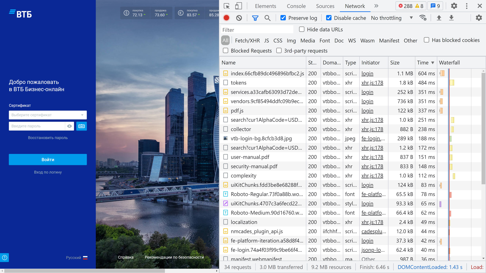
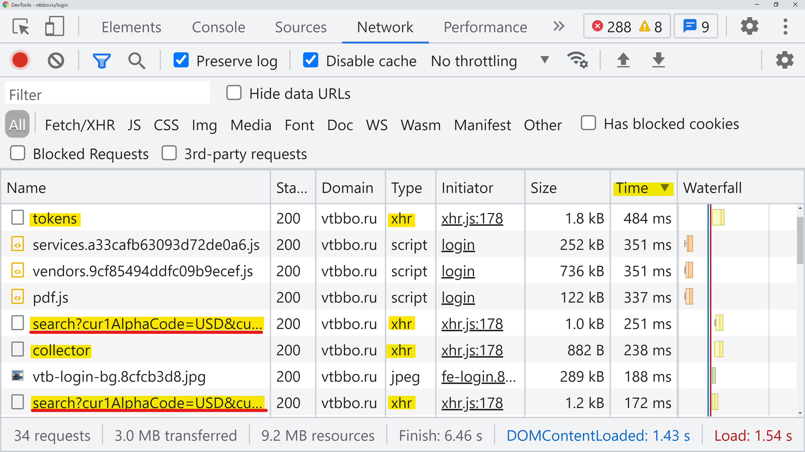
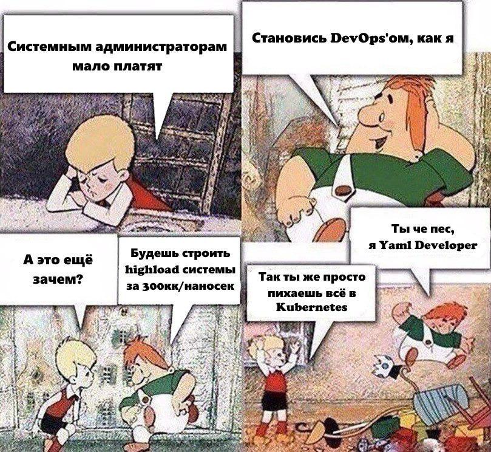
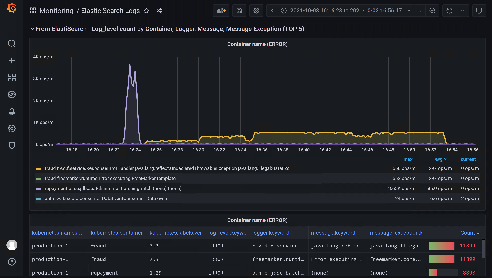
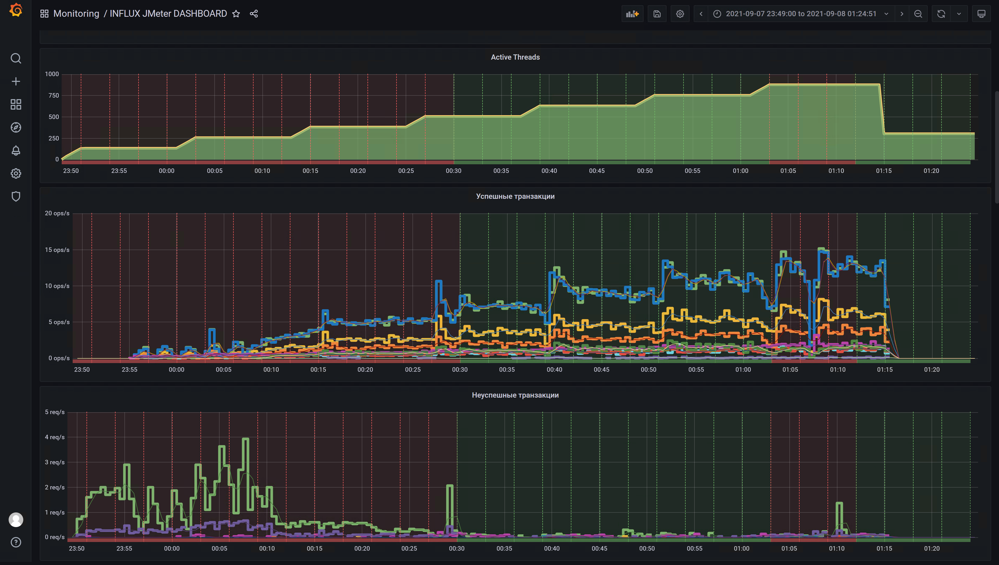
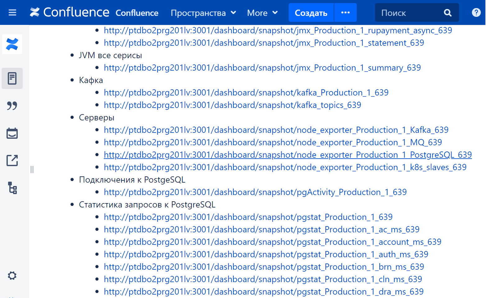
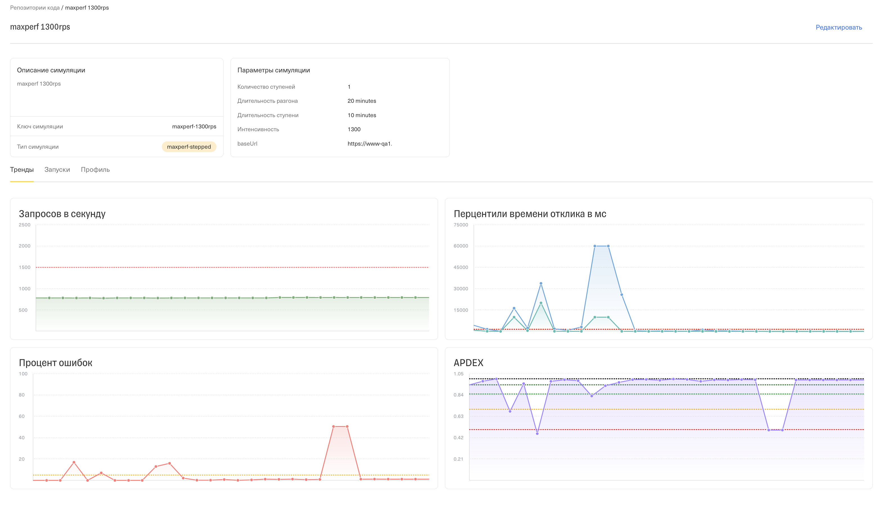

<!-- _class: lead12
-->

# Нагружаем банки Смирнов Вячеслав Рогожников Максим

## __Москва, 2021__

<!--

-->

---
<!-- _class: main
-->

# О технологиях и подходах реализации нагрузки в двух разных командах

---
<!-- _class: main -->

* О нас
* Планирование
* Профиль нагрузки
* Инструменты
* Тестовый стенд
* Тестовые данные
* Тестирование на продуктиве
* Виды тестов
* CI/CD для нагрузки
* Мониторинг
* Логи
* Отчеты
* Кто делает запуски тестов и поддерживает тесты
* Итоги

---

<!-- _class: title-->

# Тестирую и ускоряю ДБО для юридических лиц в банке ВТБ
## __Развиваю @qa_load__

<!-- 
Повышаю качество более десяти лет. Занимаюсь системой дистанционного банковского обслуживания юридических лиц. Основной профиль моей работы — тестирование производительности. Развиваю сообщество инженеров по тестированию производительности, помогая коллегам в telegram чате «QA — Load & Performance».

Занимаюсь оформлением дефектов и предварительными действиями для этого: профилированием JVM, оптимизаций SQL-запросов, разработкой досок в Grafana, группировкой логов в Kibana. Автоматизирую все, что сделал несколько раз.
Давно не писал скрипты, но поддерживаю навык за счет ответов на вопросы коллег.
Работаю в продуктовой команде. Но у нас в системе более 400-т сервисов. Из-за большого количества сервисов на поддержке наша продуктовая команда - сервисная, с большим беклогом, когда все надо сделать вчера

-->

---

<!-- _class: title_tks -->

# Тестирую и ускоряю системы в Тинькофф
## __Развиваю @qa_load__

 

<!-- 
Я к сожалению или к счастью не занимаюсь заведением дефектов. Да, раньше я это тоже делал, но сейчас у нас чуть другой подход к НТ, я говорю у нас т.к. сложно делать НТ для ГК Тинькофф в одного, когда у тебя каждый день 100 релизов разных приложений как монолитных так и микросервисных. Поэтому мой подход заключается в том, чтобы дать инструменты командам, которые сами все сделают. Про это я и поведаю вам далее.
-->

---
<!-- _class: compare2
-->

- Сервисная команда проекта
- _Регулярное НТ основных сервисов_
- _НТ прикладных сервисов не наше_
- _Занимаемся профилированием и оптимизацией всех сервисов_
- _Приоритетно занимаемся разбором обращений клиентов_

1. Сервисная команда компании
1. _Мы не всегда делаем НТ всего_
1. _Часто НТ делает команда сама_
1. _Делаем ревью скриптов и результатов_
1. _Приоритетно помогаем бизнес-критичным системам_

<!--
# В чем отличия

Максим: Кто отвечает за НТ в принципе и какая у нас роль. Мы не всегда делаем НТ всего. Часто НТ делает команда сама, а мы лишь делаем ревью скриптов и их результаты. Да, у нас есть бизнес-линии как мы это называем или продукты например инвестиции, финансовые системы и т.д. на бизнес-критичных системах мы безусловно обращаем большее вниманием и помогаем им в приоритетном порядке.

Слава: У нас есть разделение на сервисы платформы и прикладные сервисы. Сервисы платформы наиболее нагруженные, делаем НТ сами. И помогаем командам с профилированием, пишем для команд дефекты, в которых указано в какой строке кода сервис тормозит.

# Что общего
Работаем  IT-компаниях, предоставляющие банковские услуги. Где пишут и оптимизируют свой же код. Работаем в командах нагрузки, в которых сосредоточена экспертиза по тестированию производительности. В сравнимых условиях и сравнимых командах, но очень разных.

-->

---
<!-- _class: main
-->

# Планирование

---
<!-- _class: head_tks
-->
# Канбан

## __Стандартные проекты НТ__

## __Поддержка и развитие инфраструктуры__

## __Разработка инструментов НТ__

Приоритетное направление

**__**

<!--
Максим: у нас канбан. Мы работаем как сервисная команда и как я говорил ранее кроме проектов НТ у нас есть свои проекты по разработке инструментов НТ и поддержки инфраструктуры вокруг них. По этому наши задачи разделены на 3 больших блока: стандартные проекты НТ, поддержка и развитие инфраструктуры и собственно разработка инструментов НТ. Приоритет у нас больше смещен в пользу последнего.
-->

---
<!-- class: head2 -->
# Скрам

## __Оформляем дефекты и задачи на команды,__
## __но не всё подтверждаем сами__
## __и не всё  в рамках спринта__
Так как исправления багов
приходят в течение спринта
## __Часто работаем по двое__
## __Контейнеры на задачи__

**__**

<!--
Слава: у нас тоже был канбан, вытягивали. Теперь скрам - планируем. Но планируем с фактором неопределенности.

Заводим много дефектов и задач в беклоги других команд, и они возвращаются на нас с некотроллируемой скоростью, как срочные задачи, которые надо проверить в ближайшее время.

Стенда три, а инженеров больше 6-ти, и мы часто работаем по двое. Это увеличивает оценку задач.

Поэтому используем контейнеры на задачи, чтобы погасить фактор неопределенности. Например, 3 дня мы будем оптимизировать SQL-запросы. А какие именно, кто именно, пока не знаем.
-->
---
<!-- class: head2 -->
# Контейнеры на задачи

## __Разработка инструментов анализа__
Мониторинг, анализ, отчет
## __Поддержка инфраструктуры и стендов__
## __Регулярные тесты__

## __Профилирование__
## __Замеры__

**__**

---
<!-- _class: compare2
-->

- Скрам
- Регулярные тесты
- _Разработка инструментов анализа_
- _Поддержка стендов_
- _Профилирование_
- _Замеры_

1. Канбан
1. Разработка инструментов НТ
1. _Поддержка инфраструктуры_
1. _Стандартные проекты НТ_

---
<!-- _class: main
-->

# Профиль нагрузки

---

<!-- class: head2 -->

# Прогноз профиля, на основе таблиц БД

## __Состав операций с легаси__ 

Но с учетом новых операций

## __Интенсивность с легаси__

Но с учетом прогноза роста

## __SLA c продуктива__

С ненагруженной системы

**__**

<!--
Слава: Пропорции продуктива с более высокой интенсивностью
На продуктиве есть механизм КПЭ (контрольных показателей эффективности), внутренняя аналитика. На ее основе строится соотношения в профиле нагрузки. Если известно, что карточка документа открывалась за неделю 10 000 раз, а сохранялась 9 000 раз, то мы знаем, что только 90% открытий приводит к сохранениям и учитываем пропорцию в профиле. А интенсивность увеличиваем до отказа, зная, что прошли 1 продуктив, 2 продуктива, ... 20 продуктивов.

Профиль получить и реализовать в скриптах несложно. Сложно получить и согласовать SLA. В качестве SLA используются продуктивные метрики КПЭ.

-->

---
<!-- _class: head_tks
-->
# Автосбор профиля по RED либо по логам

## __Соответствие профиля продуктиву__

Минимум на 95%

## __Соответствие интенсивности продуктиву__

На 100%

## __Требуем от команд SLA и NFR__

Без этого не начинаем

**__**

---
<!-- _class: head_tks
-->

# nfr.yml обязателен для НТ

**__**

## __Требования *(проверяемые):*__
* 99, 95, 75, 50 перцентили
* Максимальное время
* Процент ошибок

*Время в миллисекундах*
## __Для *теста, запросов или групп:*__
* `all`
* `http("GET /")`
* `group("myGroup"){}`

---
<!-- _class: compare2
-->

- Прогноз профиля нагрузки
- Источник профиля: база данных
- _SLA по времени отклика утвержден_
- _Учитываем APDEX (0, SLA, 4xSLA, ...)_

1. Автосбор профиля
1. Источник профиля: логи и ELK
1. _Требуем от команд SLA_
1. _RED: (Request) Rate, Errors, Duration_
1. _Источник RED: Prometheus + ELK_

---
<!-- _class: main
-->

# Инструменты

---

# Maven, JMeter Maven Plugin, JMeter и его плагины

## __Работа по инцидентам: Skype + коллега__

Самые горячие проблемы 

## __Firefox/Chrome, Fiddler, JVM-профайлер__

Для проработки узких мест

## __Регулярные тесты: Apache.JMeter__

Для регресса

**__**

---
<!-- _footer: Источник фото: https://habr.com/ru/article/508466/
-->

# Работа по инцидентам: Skype + коллега

---

# Firefox или Chrome

## __Developer Tools / Network__

---

# Запросы к бекенду
## __Повторые запросы удалить__
## __Медленные профилировать__

---
<!-- _class: head_tks
-->
# SBT, Gatling + свои плагины, Scala, K6, GoLang

## __Единообразный процесс запуска НТ__

## __Вне зависимости от инструмента__

## __Не важно что генерирует нагрузку__

Вы всегда получите
один и тот же результат 
и набор графиков

**__**

---
<!-- _class: compare2
-->

- Инструменты удобные инженеру НТ
- Много профилирования и замеров
- _Maven, JMeter Maven Plugin, JMeter_
- _плагины JMeter_
- _Perfomance Center, Gatling_
- _Профиль нагрузки и SLA задается в property-файле_

1. Инструменты удобные разработчику
1. Единообразный процесс запуска НТ
1. _SBT, Gatling, Scala_
1. _свои плагины Gatling_
1. _K6, GoLang_
1. _Профиль нагрузки и SLA задается в yaml-файле_

---
<!-- _class: main
-->

# Тестовый стенд

---

# Фиксированные стенды, одно плечо продуктива

## __Три нагрузочных стенда__
Железо есть
Больше, чем на проде

## __Поддержка на нас__
У нас есть 4 стенда
Полноценных стенда
Справляемся с тремя

**__**

<!--
Слава: Фиксированные стенды, одно плечо продуктива
На стенды нагрузки выделено ресурсов столько же, сколько на продуктив. Но на продуктиве распределенный кластер на два плеча. А для нагрузки два отдельных стенда. 
Это позволяет проводить тестирование параллельно и на нагрузке выше продуктива.

Для локализации дефектов и проверки исправлений по ним используются третий небольшой стенды.

-->
---
<!-- _class: head_tks
-->
# Отдельные NS в k8s или переиспользуем стенд

## __Системы объединены по направлению__
И у них должны быть 
одинаковые потребности 
по ресурсам

## __Стараемся делать 1 плечо прода__

1 датацентр либо 
1 плечо нагрузки 

**__**

<!--
Максим: чаще используем отдельные NS  в кубе или же контур в облаке openstack. Либо 1 стенд на несколько систем т.е. в 1 момент времени там залита лишь 1 система, а в другой другая. Системы объединены по направлению какому-то и у них должны быть одинаковые потребности по ресурсам. Стараемся делать 1 плечо прода - 1 датацентр либо 1 плечо нагрузки если есть балансер до. Почему так, у нас очень много систем и мы быстро растем и держать контур лайк-прод нам не очень удобно.
-->

---
<!-- _class: compare2
-->

- Стенды на железных серверах
- Стационарные стенды
- Стационарные тестовые базы
- _Хорошие стенды, 1 плечо прода_
- _Kubernetes_
- _Поддерживаем стенды сами_
- _Jenkins, TeamCity, helm, kubectl_

1. Стенды в облачной инфраструктуре
1. Переиспользуемые стенды
1. Проливка обезличенных данных
1. _Хорошие стенды, 1 плечо прода_
1. _Kubernetes_
1. _Стенды поддерживают команды_
1. _Ansible, Terraform, Packer, Gitlab-CI и helm или kustomize чарты_

<!--
Что общего
Тестовые стенды у нас хорошие. В банках редко бывают плохие тестовые стенды.

В чем отличия

Слава: Почему стенды фиксированные - тестовые данные очень сложно сохранить и восстановить, их слишком много. Даже если восстановить все БД полугодовой давности, то накат миграций на террабайтные базы данных будет длиться вечно. Поэтому миграции на базы данных накатываются регулярно и не откатываются, и стенды привязаны к базам данных.

Максим: Ansible, Terraform, Packer, Gitlab-CI и helm или kustomize чарты позволяют создать кластер на лету. Также у нас автоматизирован сбор снимков с продуктива и их обезличивание.

Получается:
фиксированные БД == фиксированные стенды
создаваемые по запросу БД == создаваемые по запросу стенды
И тестовые данные играют ключевую роль

-->

---
<!-- _class: main
-->

# Тестовые данные

---

# Сгенерированные во время тестирования данные

## __Базы больше, чем на проде__
## __Минусы__
Диски заканчиваются
## __Плюсы__
Запросы завтрашнего дня
Медленные SQL-запросы

**__**

<!--
Слава: Сгенерированные во время тестирования
Хорошо бы тестировать на реальных данных, но это невозможно. Доступа до них просто нет. И чтобы знать производительность завтрашнего дня, надо иметь больше данных, чем на проде.

За счёт регулярных запусков тестов на стенде НТ много данных. И дисковое пространство наш самый критичный ресурс. 

Плюсы - есть возможность находить узкие места, раньше, чем на продуктиве. 
Минусы - можно услышать в ответ на дефект, что на продуктиве все быстро, хотя версия та же.

Фишка - данные не такие как на продуктиве. Их больше. И они не сентетические, они как настоящие.
-->

---
<!-- _class: head_tks
-->
# Клон БД с прода с обфусцированные данными

## __Сбор и обезличивание снимков прода__

## __Или сгенерированные данные__
Используем генераторы ФТ

## __Плюсы__
Данные, как на проде
По количеству и 
распределению

**__**

<!--
Максим: Клон БД с прода с обфусцированные данными. Либо генерируем данные в пустой БД или в БД с уже существующими данными. У нас много генераторов данных для ФТ и АТ, мы можем использовать их.

Фишка - данные, такие как на продуктиве (по количеству и распределению).

-->

---
<!-- _class: compare2
-->

- Данных больше, чем на продуктиве
- Данные, как результат сотен запусков тестов НТ

1. Данные, как на продуктиве
1. Генерируемые синтетические данные, генераторами ФТ и АТ
1. Проливка обезличенных данных с продуктива

<!--
Что общего
Алгоритмы + структуры данных = программа
Никлаус Вирт

Стенд с сервисами + тестовые данные = нагрузочный стенд
Инженер НТ

Для тестов НТ данные необходимы. Так или иначе их надо иметь. Обфусцированные, генерирование, любые - они нужны. Да побольше, да побольше
В чем отличия

Максим: Так ведь если данные не такие как на продуктиве, то тест не настоящий!!!!
Надо делать как на продуктиве

Слава: Да, но если не делать данных больше, чем на продуктиве, то как же спрогнозировать нагрузку завтрашнего дня? И вообще, если обезличить данные, то ФИО из Смирнов Вячеслав и Семенов Степан превращается в Иван1 Иванов и Иван2 Иванов, статистика едет, связки ломаются, запросы становятся другими или вообще перестают работать: в одной таблице номер один, а в другой таблице номер другой и ничего не работает.

Если надо тестировать на продуктивных данных, то это без деперсонализации и сразу на продуктиве. Но мы так не делаем

-->
---
<!-- _class: main
-->

# Тестирование на продуктиве

---
<!-- _class: head_tks
-->
# Тестируем на проде то, что не списывает деньги

## __Нагрузка живым трафиком: 25%, 60%, 100%__

Настройкой балансера

## __Нагрузка синтетическими запросами__

Выведя ноду из ротации

**__**

<!--
Максим: А мы так делаем. Ха, ха!!!

Не тестируется то, что списывает деньги, вроде.... Но сервисы, не списывающие деньги, можно нагрузить. Тестирование проводится вместе с командами, вместе с SRE в моменте. Подается нагрузка и оценивается, как система себя ведет. И нагрузка отключается, если что-то идет не так

Фишка в том, что можно проверить всю цепочку интеграций.

Мы также можем перенаправлять трафик. За счет балансировки нагрузки. Нагрузить одну станцию из 4-х не на 25% нагрузки, а на 60% или 100%, посмотреть, как она себя поведет под большей нагрузкой. Эта нагрузка, которая создается реальными клиентами, не нагрузочными тестами.

Также можно вывести ноду из ротации и нагрузить ее синтетической нагрузкой.

Максим: А почемы вы так не делаете?!

Слава: Так это же рискованно. Разве у вас ничего не ломалось при этом и все шло как надо?
-->

---
<!-- _class: head_tks
-->
# Нагрузка на прод отключается, если что-то не так

## __При превышении SLA__

## __1. Утилизация__
## __2. Время отклика__
## __3. APDEX__

**__**

<!--
Максим: Нет, не ломалось. Мы не доводим нагрузку до 100%. 100% меряется по SLA: утилизация, время отклика и APDEX.

Если так не делать, не тестировать на проде. То сложно получить реальную нагрузку. И не получится протестировать всю систему.
-->

---

# Не тестируем на продуктиве

## __Делаем анализ SQL-запросов с прода__
Регулярно
## __Делаем профилирование JVM__
Очень редко
## __Разбираем инциденты__
Ручные замеры

**__**

<!--

Мы на продуктиве не тестируем.
Регулярно запрашиваем и анализируем статистику с прода. По SQL-запросам в частности. Иногда профилируем проблемные сервисы под живой нагрузкой.

-->

---
<!-- _class: compare2
-->

- Не тестируем на продуктиве, наблюдаем, созерцаем
- _Анализируем pg_stat_statements_

1. Тестируем сервисы, которые не списывают деньги
1. Перенастройкой балансировщика
1. Синтетическим трафиком на выведенную из балансировки ноду
1. _Прекращаем при превышении SLA: утилизация, время отклика, APDEX_

<!--
Слава: Все протестировать нельзя. За всеми графиками не уследить, получим просто Alert Storm. Можно протестировать все в рамках одного вида теста, контролируемого, более узкого

Максим: Да, но это зависит от вида теста
-->

---
<!-- _class: main
-->

# Виды тестов

---

# Интеграционные тесты MaxPerf и замеры

## __Регулярные тесты — MaxPerf *(поиск максимальной интенсивности)*__
На продуктивных версиях
## __Замеры на разных версиях системы *каждый день*__
Chrome, Fiddler, Java-profiler
## __Подробный разбор результатов *каждого теста*__
Оформление рекомендаций

**__**

<!--
Слава: Интеграционные тесты на поиск максимума и подтверждение
Основные тесты - регрессионные.

Дополнительные тесты - просто сделать замеры в браузере. Спрофилировать и найти узкие места. А также такие же тесты но на больших объемах данных. Тоже просто в браузере. Эмуляция работы крупных клиентов. По вкладку в количество и качество дефектов, они такие же как регрессионные.

Третья группа тестов - уменьшенный регрессионный. На подтверждение исправления дефектов. Делается на небольшом стенде в четыре шага:
Эталонный тест
Установка обновления
Контрольный тест
Сравнение

-->
---
<!-- _class: head_tks
-->
# Виды НТ по уровням зрелости НТ в команде

## __*Минимум:* Debug (Smoke) и MaxPerf с подтверждением__
## __*1.* Тесты без интеграции, бенчмарки: MaxPerf с подтверждением__

## __*2.* Тесты с интеграцией: MaxPerf с подтверждением (надежность)__
## __*3.* Chaos Testing, объёмное, повторение проблем продуктива__
## __*4.* Стресс тестирование, Squeeze тестирование__

**__**

<!--
Максим: Тесты распределены по уровням зрелости процесса НТ в команде. Начало это макс.перфы, подтверждение и надежности - в виде бенчмарков. Затем уже интеграция, хаузтестинг и т.д.
У нас все эти же тесты есть.
Но если мы пишем тесты сами, то делаем команде лишь Debug (Smoke) и MaxPerf с подтверждением. Это минимальный набор тестов.

А все остальное команды делают сами по крайней мере мы к этому идем. Вот список остальных тестов:
интеграция, между другими компонентами
Chaos Testing
объёмное
повторение проблем прода
стресс тестирование
сквизтестинг

-->

---
<!-- _class: compare2
-->

- Ориентация на ускорение
- НТ ради рекомендаций и дефектов
- _Непрерывные замеры и оптимизации_
- _Еженедельный MaxPerf на продуктивной версии системы_

1. Ориентация на покрытие
1. Виды НТ по уровням зрелости
1. _Debug (Smoke) и MaxPerf с подтверждением_
1. _Бечмарки (на один сервис)_
1. _Тесты с интеграцией_
1. _Chaos Testing_
1. _Объёмное_
1. _Стресс тестирование_
1. _Squeeze тестирование_

<!--
Слава: Сквиз тестинг, это что такое?

Максим: Это бред из нетфликса. Ты выводишь одну ноду из ротации. И грузишь ее до упора. Получаешь значение в RPS. Скейлишь и нагружаешь ее снова.

Слава: У нас это делается так. Убраны лимиты подам. И выставлены их скейлинги.
1. Перезапустить сервисы и нагрузить тестом MaxPerf
2. Получить kubectl top (CPU Time поды / длительность жизни поды) и сгруппировать результаты по сервисам
3. Профилировать то, что потребило больше всех CPU и память
4. Скейлить, как запасной вариант

Максим: Вы делаете лишь стандартные тесты. И не раскрываете все ситуации. А мне кажется, что надо делать так, чтобы разработчики запускали быстрые бенчмарки у себя. И не ждали нагрузочного контура. 

Разработчики запускают тесты на своих машинах.

Слава: А как же автоматизация?

Максим: Да, мы идем к тому, чтобы бенчмаки запускались тоже в CI/CD, поднималась пода с сервисом, обстреливалась тестом и получался результат.
-->

---
<!-- _class: main
-->

# CI/CD для нагрузки

---

# Jenkins, Nexus, Maven, *Python, Bash, Java*

## __Распределенные тесты из своего Jenkins *, используя общие Nexus, Git*__
## __Свои генераторы нагрузки *на железе, не в Kubernetes*__
## __Запуск тестов с Maven *и JMeter Maven Plugin*__

**__**

---

# *Jenkins, Nexus, Maven,* Python, Bash, Java

## __*Распределенные тесты из своего Jenkins , используя общие Nexus, Git*__
## __*Свои генераторы нагрузки на железе, не в Kubernetes*__
## __*Запуск тестов с Maven и JMeter Maven Plugin*__
## __Анализ результатов тестов на соответствие SLA *на Python*__
## __Сравнение конфигураций и версий на стендах *на Python*__
## __Сохранение снимков Grafana по тестам *на Java и Selenium*__
## __Автоматизация профилирования JVM *на Bash c kubectl*__

**__**

---
<!-- _class: head_tks
_footer: Источник фото: https://habr.com/ru/article/508466/
-->

<!--
Максим: 
-->

---
<!-- _class: head_tks
-->
# Gitlab-CI, Nexus, Docker

## __Мы YAML-Developer-ы__
pipeline в Gitlab-CI похож на
Docker-Compose + Jenkins
## __Все в одном месте, все стандартизируется и переиспользуется__
За счет Gitlib-CI и Docker

## __Несколько видов генераторов под разные типы тестов__
Генераторы общие

**__**

<!--
Максим: в основе у нас Gitlab CI, Nexus, Docker.
А мы YAML-Developer-ы, pipeline в Gitlab-CI похож на Docker-Compose + Jenkins.
Плюс: все в одном месте, все стандартизируется и переиспользуется. За счет Gitlib-CI и Docker. Запуски выполняются на любом генераторе нагрузки. У нас несколько видов под разные типы тестов.

-->

---
<!-- _class: compare2
-->

- Jenkins
- Запуск тестов с JMeter Maven Plugin
- Выделенные генераторы под проект
- _Инфраструктура нагрузки на периодических задачах Jenkins_

1. Gitlab-CI
1. Запуск тестов из Docker-контейнеров
1. Общие генераторы для всех
1. _Разные генераторы под разные виды тестов производительности_

<!--
Максим: А почему вы не делаете также?

Слава: Мы, возможно, придем к такому. Сейчас у нас свой Jenkins и свои агенты, чтобы не замедлять другие команды. Чтобы тесты производительности, которые выполняются долго и требуют много ресурсов, никак не замедляли процессы сборок команд разработки. Но мы планируем в этом году перейти в общебанковскую инфраструктуру.
А вот про запуск тестов из Docker пока не думал, это интересно
-->

---
<!-- _class: main
-->

# Мониторинг

---

# VictoriaMetrics, InfluxDB (1.8), Grafana

## __VictoriaMetrics *заменила Prometheus*__
## __InfluxDB *для «выгружалок»*__
## __Следим за новинками Grafana__
## __Детальный мониторинг всего__
_на поддержке команды НТ_

**__**

---
<!-- _class: head_tks
-->
# Prometheus + Grafana

Стандарт де-факто
в нашей отрасти

**__**

---
<!-- _class: compare2
-->

- VictoriaMetrics вместо Prometheus
- Grafana
- Мониторинг на нашей поддержке
- _InfluxDB для всего остального_

1. Prometheus вместе с VictoriaMetrics
1. Grafana
1. Мониторинг на поддержке команд

---
<!-- _class: main
-->

# Логи

---

# Единый logback.xml, Fluentd, ElasticSearch

## __Единый формат логов для всех сервисов__
Переопределен logback.xml
## __Fluentd парсит строки логов на поля__
## __Маскирование для Message на JRuby__
User TestUser* timeout *sec
## __ElasticSearch хранит логи и поля 4 дня__

**__**

<!--
Слава: Настроенные правила парсинга логов на поля в logstash, работа на основе ELK
Мы настроили всем сервисам единый формат логирования. Передав свои logback-конфиги в каждый. А для единого формата логирования уже настроен парсер лога на поля: время, уровень, сервис, поток, класс, сообщение, исключение. Также logtash позволяет создавать поля на основе полей, кодом на JRuby, поэтому сообщения маскируются, чтобы по ним можно было делать группировку.
Такие структурированные логи позволяют быстро выявлять проблемы.

Ранее, когда не был настроен единый формат логов и парсинг, использовались скрипты на python, которые выгружали логи сервиса из ELK в формате CSV и парсили его, а результат парсинга сохранялся в InfluxDB в виде статистики. Теперь исходные данные и поля для группировки в ELK.
-->
---

---
<!-- _class: head_tks
-->
# Внутреняя разработка на основе ELK

## __Выгрузка всех логов приложений__

## __Поиск проблем по логам__
## __Аллертинг на основе логов__

**__**

<!--
Максим: у нас внутренняя разработка как средство мониторинга логов на основе ELK. В нее выгружаются логи всех приложений и мы осуществляем поиск проблем и алертинг на их основе. Команда разрабатывающая продукт сама заводит логи в данную систему и заинтересована в их поддержании и настройки алертов в актуальном состоянии.

-->

---
<!-- _class: compare2
-->

- ElasticSearch, fluentd, logback.xml
- *Группировка по маскированным текстам сообщений*

1. Разработка на базе ELK
1. *Аллертинг на основе логов и полнотекстовый поиск по ним*

---
<!-- _class: main
-->

# Отчеты

---

# Снимки Grafana и карточки страниц в Confluence

## __Python-скрипт анализирует результаты *JMeter-тестов из InfluxDB*__

## __Используем снимки Grafana *для долговременного хранения метрик*__
Grafana с PostgreSQL Storage
А снимки делает Selenium

## __Результаты регулярных тестов в карточках страниц Confluence__
В карточке дата и итог теста
На странице ставится тег НТ
Ссылки на снимки Grafana
*+ добавляется любой текст*
Confluence строит сводку

**__**

---
# Автоматически ставятся аннотации OK/KO

---
# Ссылки на снимки в Confluence

---
<!-- _class: head_tks
-->
# Не пишем отчеты вообще, используем «Cosmos»

## __Все логи в едином хранилище *: разработка на ELK*__

## __Все метрики в едином хранилище *: Prometheus*__

## __Результаты НТ в едином хранилище *: InfluxDB*__

## __Все требования SLA и NFR в GIT *: в nfr.yml*__
Есть всё для отчета
## __Портал НТ «Cosmos» *(внутренняя разработка)*__
* строит отчеты сам
* сравнивает результаты

**__**

<!--
Максим: мы не пишем отчеты вообще. Да, это так. Сейчас расскажу как мы к этому пришли. У нас все логи собираются в 1 месте, все графики мониторингов тоже в 1 месте и данные с генераторов нагрузки у нас тоже в 1 месте, а ещё у нас же есть требования SLA и NFR, без которых мы не запускаем НТ. А значит у нас есть все, чтобы сделать отчёт мечты - автоматически. Да, хочется сразу оговориться, что мы ещё не научились определять уровни макс.перфа и т.п. но вот сравнивать тесты регресса можем, а также подгружать все графики в 1 место. Все графики и анализ привязываются к запускам теста из gitlab-ci и можно провалиться в каждый отчет и посмотреть как и что шло.
-->

---
<!-- _class: head_tks
-->

# Портал НТ «Cosmos»

---
<!-- _class: compare2
-->

- Заполняем карточку отчета
- *Разработка на Python ставит Grafana Annotation на основе SLA из json*
- *Снимки Grafana собираются автоматически и содержат всё*
- _Confluence собирает отчеты по карточкам страниц с тегом НТ_

1. Не пишем отчеты вообще
1. *Требований ко всем сервисам описаны в едином виде в nfr.yml*
1. *Единые хранилища содержат все метрики, логи и результаты*
1. _Портал НТ «Cosmos» собирает отчет автоматически_

---
<!-- _class: main
-->

# Кто делает запуски тестов и поддерживает тесты

---

# Запускаем и поддерживаем тесты сами

## __*Поддерживаем стенды с интеграциями*__

## __*Поддерживаем мониторинг*__

## __Поддерживаем и запускаем тесты__

*Не делаем ревью тестов*

## __Оформляем дефекты__
## __И рекомендации__

**__**

---
<!-- _class: head_tks
-->
# Поддержка НТ на командах без нагрузочников

## __Запускаем лишь базовые тесты__
*если сами их писали*
## __Консультируем по любому вопросу__
*Команда тестирует сама*

## __Поддержка тестов на команде__

## __Команда НТ делает ревью кода__
*Все тесты, как код, в Git
Команда НТ делает Approve*

**__**

<!--
Кто делает запуски тестов

Максим: Мы запускаем лишь базовые тесты, когда сами пишем скрипты как я говорил ранее, дальше команда сама. Если команда писала сама скрипты, то она сама и всё запускает. Да, мы можем проконсультировать в любой момент команду по любому вопросу связанному с порядком запуска или анализом проблем.

Кто поддерживает тесты?

Максим: у нас это на команде разрабатывающей проект т.к. ещё раз повторюсь она отвечает за его качество и команде НТ физически не может уследить за всеми изменениями во всех системах ГК Тинькофф какого бы размера она не была, мы это приняли как факт. Да, мы конечно помогаем в сложных ситуациях или когда команда не знает как и что поменять в скрипте. Также мы можем расширить функционал тестов по запросу команды например добавить новый протокол или сделать сложный сценарий, но чаще мы лишь делаем пример на скажем 1 запрос, а команда дальше сама дорабатывает свой скрипт с нашими консультациями. Почему так? Возможно это выглядит жестоко, но только так можно научить людей, что-то делать самих т.к. сделав все за них они при новой любой проблеме снова придут к вам, а это уже контрпродуктивно.
-->

---
<!-- _class: compare2
-->

- Запускаем и поддерживаем тесты
- *Рекомендуем оптимизации*
- *Не делаем ревью скриптов JMeter*
- *Тесты выполняются нами после релиза, каждый спринт*

1. Помогаем начать НТ в команде
1. *Консультируем по всем вопросам*
1. *Делаем ревью кода тестов*
1. *Команда сама поддерживает и запускает тесты перед релизом*

---
<!-- _class: main
-->

# Итоги

---
<!-- _class: main -->

- О докладчиках *: сервисная команда проекта или всей компании*
- Планирование *: скрам или канбан*
- Профиль нагрузки *: профиль из базы данных или из ELK с NFR из yml*
- Инструменты *: JMeter или Gatling+k6*
- Тестовый стенд *: prod-like железный стационарный или виртуальный*
- Тестовые данные *: от нагрузки или генерируемые/анонимизируемые*
- Тестирование на продуктиве *: нет или живым трафиком с тестами*
- Виды тестов *: ориентация на дефекты или на покрытие*
- CI/CD для нагрузки *: Jenkins+Maven или Gitlab-CI+Docker с генераторов*
- Мониторинг *: Prometheus и/или VictoriaMetrics, InfluxDB, Grafana*
- Логи *: ElasticSearch и подготовка данных для него*
- Отчеты *: InfluxDB+Grafana+Confluence или портал НТ «Cosmos»*
- Кто делает запуски тестов и поддерживает тесты *: сами или команды, в которых нет нагрузочников, но есть разработчики и тестировщики*

---

<!-- _class: lead12
-->

# Вопросы/ответы  Нагружаем банки ВТБ, Тинькофф

## __Вячеслав, Максим, @qa_load__

